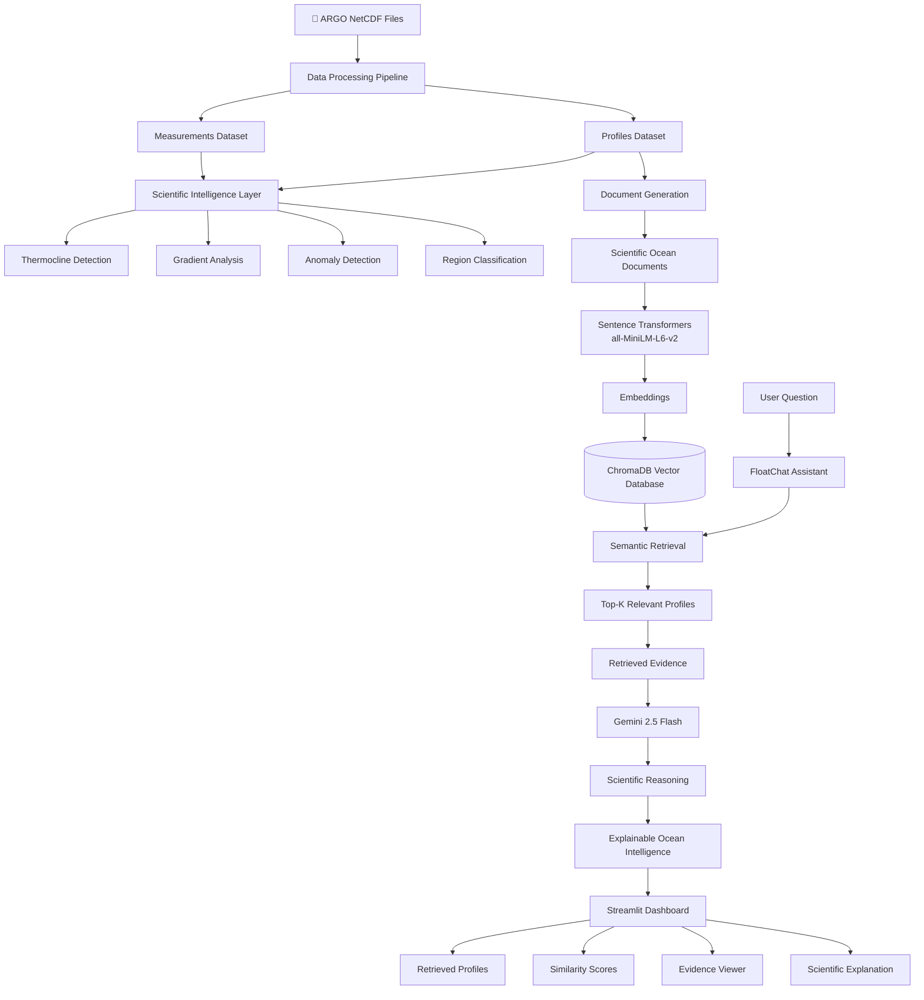

# FloatChat-RAG 🌊

## Retrieval-Augmented Ocean Intelligence Assistant

FloatChat-RAG is an AI-powered ocean intelligence platform that transforms ARGO oceanographic measurements into explainable scientific insights using Retrieval-Augmented Generation (RAG), semantic search, and large language models.

Developed for the Neural Nexus AI/ML Hackathon 2026.

---

## 🚀 Problem Statement

Oceanographic datasets contain thousands of profiles and hundreds of thousands of measurements.

Challenges include:

* Scientific NetCDF data formats
* Large-scale multidimensional measurements
* Difficult manual exploration
* Limited accessibility for non-domain experts

As a result, valuable oceanographic information remains difficult to discover and interpret.

---

## 💡 Solution

FloatChat-RAG combines:

* Ocean data analytics
* Scientific intelligence
* Vector databases
* Semantic search
* Large Language Models

to enable natural language interaction with ARGO ocean data.

Users can ask:

* Which profiles indicate deep ocean conditions?
* Find profiles with high salinity levels.
* Which profiles show the warmest temperatures?
* Compare deep and surface ocean conditions.

and receive evidence-backed scientific explanations.

---

## 🧠 RAG Architecture

User Question
↓
Sentence Transformer Embeddings
↓
ChromaDB Vector Search
↓
Top-K Ocean Profiles
↓
Retrieved Evidence
↓
Gemini 2.5 Flash
↓
Scientific Explanation

---

##    Architecture Diagram


---

## 🔥 Key Innovation

FloatChat-RAG does not generate answers directly.

Instead it:

1. Retrieves relevant ocean profiles
2. Shows retrieval evidence
3. Displays similarity scores
4. Generates scientific reasoning grounded in retrieved data

This creates an Explainable AI workflow.

---

## ⚙️ System Architecture

FloatChat follows a multi-layer architecture:

Data Ingestion
↓
Query Intelligence
↓
Scientific Intelligence
↓
Analytics Layer
↓
RAG Retrieval Layer
↓
Gemini Scientific Reasoning
↓
Visualization & Insights

---

## System workflow


---

## 🌊 Core Features

### Ocean Analytics

* ARGO trajectory visualization
* Temperature profile exploration
* Salinity profile exploration
* Cycle comparisons
* Regional analysis
* Heatmaps and trends

### Scientific Intelligence

* Thermocline detection
* Temperature gradient analysis
* Surface vs deep summaries
* Profile quality indicators
* Depth-band summaries
* Ocean anomaly identification

### Query Intelligence

* Natural language querying
* Intent detection
* Entity extraction
* Query explanation
* Guided prompts

### RAG Assistant

* ChromaDB vector database
* Sentence Transformer embeddings
* Semantic profile retrieval
* Similarity scoring
* Retrieved evidence display
* Gemini-powered scientific reasoning
* Explainable AI workflow

---

## 📊 Dataset Summary

Source:

* ARGO Global Data Repository

Coverage:

* Indian Ocean ARGO Floats

Dataset Statistics:

* 25 ARGO float files
* 1,882 ocean profiles
* 138,190 measurements
* Temperature observations
* Salinity observations
* Pressure-depth measurements

---

## ⚙️ Data Processing Pipeline

### Step 1: NetCDF Parsing

Extract:

* Pressure (PRES)
* Temperature (TEMP)
* Salinity (PSAL)
* Latitude
* Longitude
* Profile date
* Cycle number

### Step 2: Data Cleaning

Validation rules:

* Pressure: 0–2500 dbar
* Temperature: -2°C to 40°C
* Salinity: 0–50 PSU

### Step 3: Structured Storage

Profiles Dataset

* float_id
* cycle_number
* latitude
* longitude
* profile_date
* n_levels

Measurements Dataset

* float_id
* cycle_number
* pressure
* temperature
* salinity

### Step 4: Vector Database Creation

Profiles are converted into scientific documents and embedded using:

* Sentence Transformers (all-MiniLM-L6-v2)

Stored in:

* ChromaDB

for semantic retrieval.

---

## 🛠️ Tech Stack

### AI / ML

* Gemini 2.5 Flash
* ChromaDB
* Sentence Transformers
* Retrieval-Augmented Generation (RAG)

### Data Processing

* Python
* Pandas
* NumPy
* Xarray
* NetCDF4
* PyArrow

### Visualization

* Plotly
* Matplotlib

### Frontend

* Streamlit

---

## 📦 Project Structure

```text
FloatChat/
│
├── app.py
│
├── rag/
│   ├── create_documents.py
│   ├── create_vector_db.py
│   ├── retrieve.py
│   └── gemini_rag.py
│
├── core/
├── components/
├── views/
├── data/
└── requirements.txt
```

---

## ▶️ Running the Application

Install dependencies:

```bash
pip install -r requirements.txt
```

Launch:

```bash
python -m streamlit run app.py
```

---

## 📈 Example RAG Workflow

Question:

```text
Which profiles indicate deep ocean conditions?
```

Retrieved Profiles:

```text
1902676_9
1902674_63
1902677_46
```

Scientific Explanation:

```text
All profiles indicate deep ocean conditions due to
maximum observed pressures near 2000 dbar,
corresponding to depths of approximately 2000 meters.
```
# 🏆 Research Contributions

FloatChat-RAG contributes a Retrieval-Augmented Ocean Intelligence
framework for scientific exploration of ARGO oceanographic observations.

## Key Contributions

-   Developed a **Retrieval-Augmented Generation (RAG)** pipeline for
    oceanographic datasets using semantic search.
-   Integrated **Sentence Transformers** with **ChromaDB** to enable
    efficient retrieval across **1,882 ARGO profiles**.
-   Designed a **metadata-aware retrieval strategy** combining vector
    similarity with oceanographic metadata such as region, cycle number,
    float ID, and profile location.
-   Built an **Explainable AI workflow**, where every generated
    explanation is grounded in retrieved scientific evidence rather than
    hallucinated responses.
-   Developed an interactive **Ocean Intelligence Dashboard** featuring:
    -   Temperature vs Depth visualization
    -   Salinity vs Depth visualization
    -   Retrieved Float Location Mapping
    -   Ocean Profile Highlights
    -   Scientific reasoning powered by Gemini 2.5 Flash
-   Created a scalable pipeline for processing **NetCDF oceanographic
    datasets** into structured documents suitable for semantic
    retrieval.

------------------------------------------------------------------------

# 📊 Experimental Results

## Dataset Statistics

  Metric                                                                 Value
  --------------------- ------------------------------------------------------
  ARGO Float Files                                                      **25**
  Ocean Profiles                                                     **1,882**
  Ocean Measurements                                              **138,190+**
  Geographic Coverage                                         **Indian Ocean**
  Variables               Temperature, Salinity, Pressure, Latitude, Longitude
  Embedding Model                                             all-MiniLM-L6-v2
  Vector Database                                                     ChromaDB
  LLM                                                         Gemini 2.5 Flash

## Example Retrieval

### User Query

``` text
Show the deepest ocean profile
```

### Retrieved Profile

``` text
Float ID        : 1902670
Cycle           : 60
Maximum Depth   : 2028.0 m
Region          : Near Sri Lanka, Northern Indian Ocean
```

### Scientific Explanation

> The retrieved profile represents the deepest observed ocean conditions
> among the retrieved candidates, reaching approximately **2028
> meters**. Temperature decreases significantly with depth, while
> salinity remains relatively stable, reflecting characteristics of
> deep-water masses within the Northern Indian Ocean.

### Generated Visualizations

-   Temperature vs Depth Profile
-   Salinity vs Depth Profile
-   Float Location Map
-   Ocean Profile Highlights
-   Scientific Reasoning Panel

------------------------------------------------------------------------

# 🚀 Performance Highlights

Although FloatChat-RAG is primarily a scientific exploration platform
rather than a predictive model, its architecture demonstrates efficient
semantic retrieval over large-scale oceanographic datasets.

  Component            Implementation
  -------------------- --------------------------------
  Embedding Model      all-MiniLM-L6-v2
  Vector Search        ChromaDB
  Retrieval Strategy   Metadata + Semantic Similarity
  Reasoning Engine     Gemini 2.5 Flash
  Data Processing      NetCDF → Scientific Documents
  Visualization        Streamlit + Plotly

------------------------------------------------------------------------

# 🌟 Novelty Highlights

Unlike conventional chatbot-based assistants, FloatChat-RAG introduces
an **evidence-grounded scientific retrieval workflow** specifically
designed for oceanographic data.

## Novel Aspects

-   Retrieval-Augmented Generation applied to ARGO ocean observations.
-   Semantic search across scientific profiles instead of keyword-based
    retrieval.
-   Metadata-aware retrieval incorporating oceanographic attributes.
-   Explainable scientific reasoning backed by retrieved evidence.
-   Integrated scientific visualization within the conversational
    workflow.
-   Interactive ocean intelligence dashboard combining retrieval,
    analytics, and AI reasoning.

------------------------------------------------------------------------

# 🔬 Research Significance

FloatChat-RAG demonstrates how Retrieval-Augmented Generation can
support scientific discovery by bridging structured oceanographic
datasets with large language models.

## Potential Applications

-   Marine Research
-   Climate Change Analysis
-   Ocean Monitoring
-   Educational Platforms
-   Environmental Intelligence
-   Decision Support Systems

------------------------------------------------------------------------

# 🏅 Repository Badges

Place these immediately below your project title.

``` markdown


```

### Rendered Badges

-   🐍 Python 3.11
-   🔴 Streamlit Dashboard
-   🔵 Gemini 2.5 Flash
-   🟢 ChromaDB
-   🟠 Sentence Transformers
-   🟣 Retrieval-Augmented Generation
-   🟢 MIT License
-   🟢 Hackathon Project

---

## 🚀 Future Work

* Region-aware retrieval
* Ocean knowledge graph integration
* Hybrid search (keyword + vector)
* Multi-turn conversational memory
* Advanced anomaly detection
* Ocean research copilot
* BGC float integration

---
# 🚀 Installation & Setup

## 1. Clone the Repository

```bash
git clone https://github.com/kanmaniannie180-hub/floatchat_rag.git
cd floatchat_rag
```

---

## 2. Create a Virtual Environment (Recommended)

### Windows

```bash
python -m venv venv
venv\Scripts\activate
```

### Linux / macOS

```bash
python3 -m venv venv
source venv/bin/activate
```

---

## 3. Install Dependencies

```bash
pip install -r requirements.txt
```

---

## 4. Configure the Gemini API Key

Create a file named:

```text
.env
```

Add your Gemini API key:

```env
GEMINI_API_KEY=YOUR_GEMINI_API_KEY
```

You can obtain a free API key from:

https://aistudio.google.com/app/apikey

---

## 5. Prepare the Vector Database (Optional)

If the ChromaDB vector database is not included, generate it by running:

```bash
python rag/build_documents.py

python rag/create_vector_db.py
```

This will:

- Parse ARGO NetCDF files
- Generate scientific documents
- Create embeddings
- Build the ChromaDB vector database

---

## 6. Launch FloatChat

```bash
streamlit run app.py
```

or

```bash
python -m streamlit run app.py
```

---

## 7. Open the Application

After launching, Streamlit will display something similar to:

```
Local URL:
http://localhost:8501
```

Open the URL in your browser.

---

# 💬 Example Questions

Try asking questions such as:

```
Show the deepest ocean profile.

Find profiles near Sri Lanka.

Compare temperature and salinity profiles.

Show high salinity events.

Which profile has the warmest surface temperature?

Explain the retrieved ocean observations.

Show thermocline characteristics.

Find deep ocean profiles in the Indian Ocean.

Compare retrieved profiles.

Visualize the retrieved float locations.
```

---

# 📁 Required Project Structure

```
FloatChat-RAG/
│
├── app.py
├── requirements.txt
├── .env
│
├── data/
│
├── rag/
│   ├── build_documents.py
│   ├── create_vector_db.py
│   ├── gemini_rag.py
│   ├── chroma_db/
│   └── documents.pkl
│
├── views/
├── core/
├── assets/
└── components/
```

---

# ⚠️ Notes

- Python **3.10+** is recommended.
- A valid **Gemini API Key** is required.
- Ensure all required dependencies are installed before launching the application.
- If the vector database is not present, generate it before querying the assistant.

  ---
## 🏁 Conclusion

FloatChat-RAG transforms large-scale oceanographic measurements into explainable scientific intelligence through semantic retrieval, vector search, and AI-powered reasoning.

### Final Statement

"From raw ocean measurements to explainable ocean intelligence."
