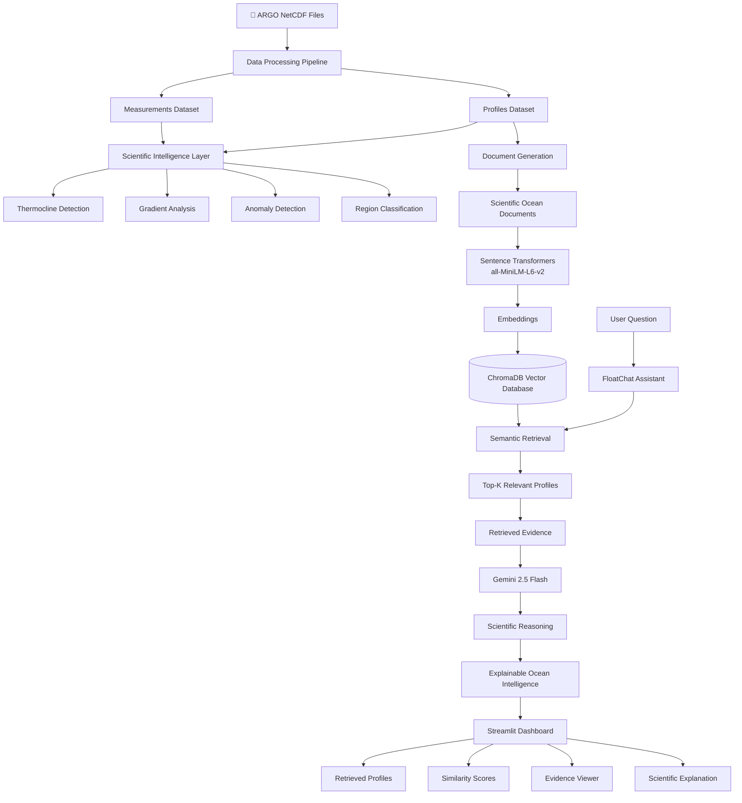

# FloatChat-RAG 🌊

## Retrieval-Augmented Ocean Intelligence Assistant

FloatChat-RAG is an AI-powered ocean intelligence platform that transforms ARGO oceanographic measurements into explainable scientific insights using Retrieval-Augmented Generation (RAG), semantic search, and large language models.

Developed for the Neural Nexus AI/ML Hackathon 2026.

---

## 🚀 Problem Statement

Oceanographic datasets contain thousands of profiles and hundreds of thousands of measurements.

Challenges include:

* Scientific NetCDF data formats
* Large-scale multidimensional measurements
* Difficult manual exploration
* Limited accessibility for non-domain experts

As a result, valuable oceanographic information remains difficult to discover and interpret.

---

## 💡 Solution

FloatChat-RAG combines:

* Ocean data analytics
* Scientific intelligence
* Vector databases
* Semantic search
* Large Language Models

to enable natural language interaction with ARGO ocean data.

Users can ask:

* Which profiles indicate deep ocean conditions?
* Find profiles with high salinity levels.
* Which profiles show the warmest temperatures?
* Compare deep and surface ocean conditions.

and receive evidence-backed scientific explanations.

---

## 🧠 RAG Architecture

User Question
↓
Sentence Transformer Embeddings
↓
ChromaDB Vector Search
↓
Top-K Ocean Profiles
↓
Retrieved Evidence
↓
Gemini 2.5 Flash
↓
Scientific Explanation

---



## 🔥 Key Innovation

FloatChat-RAG does not generate answers directly.

Instead it:

1. Retrieves relevant ocean profiles
2. Shows retrieval evidence
3. Displays similarity scores
4. Generates scientific reasoning grounded in retrieved data

This creates an Explainable AI workflow.

---

## ⚙️ System Architecture

FloatChat follows a multi-layer architecture:

Data Ingestion
↓
Query Intelligence
↓
Scientific Intelligence
↓
Analytics Layer
↓
RAG Retrieval Layer
↓
Gemini Scientific Reasoning
↓
Visualization & Insights

---

## 🌊 Core Features

### Ocean Analytics

* ARGO trajectory visualization
* Temperature profile exploration
* Salinity profile exploration
* Cycle comparisons
* Regional analysis
* Heatmaps and trends

### Scientific Intelligence

* Thermocline detection
* Temperature gradient analysis
* Surface vs deep summaries
* Profile quality indicators
* Depth-band summaries
* Ocean anomaly identification

### Query Intelligence

* Natural language querying
* Intent detection
* Entity extraction
* Query explanation
* Guided prompts

### RAG Assistant

* ChromaDB vector database
* Sentence Transformer embeddings
* Semantic profile retrieval
* Similarity scoring
* Retrieved evidence display
* Gemini-powered scientific reasoning
* Explainable AI workflow

---

## 📊 Dataset Summary

Source:

* ARGO Global Data Repository

Coverage:

* Indian Ocean ARGO Floats

Dataset Statistics:

* 25 ARGO float files
* 1,882 ocean profiles
* 138,190 measurements
* Temperature observations
* Salinity observations
* Pressure-depth measurements

---

## ⚙️ Data Processing Pipeline

### Step 1: NetCDF Parsing

Extract:

* Pressure (PRES)
* Temperature (TEMP)
* Salinity (PSAL)
* Latitude
* Longitude
* Profile date
* Cycle number

### Step 2: Data Cleaning

Validation rules:

* Pressure: 0–2500 dbar
* Temperature: -2°C to 40°C
* Salinity: 0–50 PSU

### Step 3: Structured Storage

Profiles Dataset

* float_id
* cycle_number
* latitude
* longitude
* profile_date
* n_levels

Measurements Dataset

* float_id
* cycle_number
* pressure
* temperature
* salinity

### Step 4: Vector Database Creation

Profiles are converted into scientific documents and embedded using:

* Sentence Transformers (all-MiniLM-L6-v2)

Stored in:

* ChromaDB

for semantic retrieval.

---

## 🛠️ Tech Stack

### AI / ML

* Gemini 2.5 Flash
* ChromaDB
* Sentence Transformers
* Retrieval-Augmented Generation (RAG)

### Data Processing

* Python
* Pandas
* NumPy
* Xarray
* NetCDF4
* PyArrow

### Visualization

* Plotly
* Matplotlib

### Frontend

* Streamlit

---

## 📦 Project Structure

```text
FloatChat/
│
├── app.py
│
├── rag/
│   ├── create_documents.py
│   ├── create_vector_db.py
│   ├── retrieve.py
│   └── gemini_rag.py
│
├── core/
├── components/
├── views/
├── data/
└── requirements.txt
```

---

## ▶️ Running the Application

Install dependencies:

```bash
pip install -r requirements.txt
```

Launch:

```bash
python -m streamlit run app.py
```

---

## 📈 Example RAG Workflow

Question:

```text
Which profiles indicate deep ocean conditions?
```

Retrieved Profiles:

```text
1902676_9
1902674_63
1902677_46
```

Scientific Explanation:

```text
All profiles indicate deep ocean conditions due to
maximum observed pressures near 2000 dbar,
corresponding to depths of approximately 2000 meters.
```

---

## 🚀 Future Work

* Region-aware retrieval
* Ocean knowledge graph integration
* Hybrid search (keyword + vector)
* Multi-turn conversational memory
* Advanced anomaly detection
* Ocean research copilot
* BGC float integration

---

## 🏁 Conclusion

FloatChat-RAG transforms large-scale oceanographic measurements into explainable scientific intelligence through semantic retrieval, vector search, and AI-powered reasoning.

### Final Statement

"From raw ocean measurements to explainable ocean intelligence."
